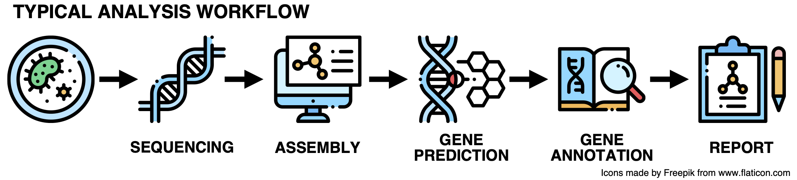

# Problem Set 4: Using and Sharing Code

As usual, be sure to look through the rubric so you know how your work is being
evaluated.

Let us know the names of each partner below.

Partner 1: Liam Smith

Partner 2: Wren Yockey

In the space below, write a paragraph with take aways you got from 
talking about working styles with your partner.

Prefer to work independantly, but checking in frequently when stuck. Planning to split up work evenly, alternating between writing and testing functions. Both work best at night. 


## 1. Convoluted Plots

Imagine that you are collaborating with others to write a computational essay.
You have your data and the text of the essay is completely written. However,
someone has mixed up the data files, and you have not yet plotted your data. 
You have been tasked with solving the mystery and plotting the data for your
collaborators.

In the file `vroom.qmd`, you will find the current draft of the computational
essay. Convert this over to a Jupyter notebook.

### 1.1. Write a Plotting Function

Near the top of `vroom.ipynb`, you will see a function called
`make_results_plot` that has been partially filled in. Read the comments in the
body of the function, and modify it to appropriately plot a data set from a CSV.

In this function, you don't have to modify the docstring, and you should not
have to add any new lines of code beyond what is already in the function of the
body. Essentially, you only need to use the `plt.plot` function to properly 
plot the data, and then label the axes and title the plot appropriately.

As you complete this function, make sure that you follow the
[rules of a good plot](https://olincollege.github.io/softdes-material/4-using-sharing-code.html#data-visualization):
your axes should be labeled with a description and units, and the plot should 
be appropriately titled. You should also make sure that your plot does not use
lines to join adjacent points (i.e., each point should be on its own,
unconnected to other points).

### 1.2. Plot the Correct Data

In the `data` folder, you will find files with the names `test_design_1.csv`
through `test_design_4.csv`. Four code cells in the notebook have comments for
you to fill in with code to plot each of these data sets once.

Read the text of the computational essay to determine the characteristics of 
the data you want to plot. Then, plot the appropriate data set in each cell 
using the `make_results_plot` function that you wrote in the previous section. 
You may try plotting all of the data sets and then matching them to the 
appropriate cells if you prefer.

## 2. Gene Finder

### 2.0. Introduction

Computational approaches for analyzing biological data have revolutionized many
subfields of biology. For example, bioinformatics is a term that describes 
this type of interdisciplinary fusion of biology, computation, math, and 
statistics.

In this problem, you will be applying your Python and computing skills to a
analyze the SARS-CoV-2 virus. 

Specifically, your task is to write code to identify potential protein-coding
genes in the SARS-CoV-2 virus, and use the
[protein-BLAST](http://www.ncbi.nlm.nih.gov/blast/Blast.cgi?PROGRAM=blastp&PAGE_TYPE=BlastSearch&LINK_LOC=blasthome)
search engine to determine which of these genes may encode key proteins of the
virus. By doing this, you will get an insight into the process that biologists
use when trying to understand something like COVID-19. Specifically, the work
you will do in this project roughly corresponds to the "Gene Prediction" step 
in the graphic below.



In coming years, developments in artificial intelligence are likely to 
influence the way we carry out gene prediction and related scientific 
processes. One example of using AI to better understand proteins for 
medical purposes is [The Alpha Fold Project](https://alphafold.ebi.ac.uk/).

Gene prediction is important because once we know where the protein-coding 
genes are, we can begin to decode the form and function of these proteins, 
and then the mechanisms that regulate the synthesis of these
proteins. With a firm understanding of each of these components of the system,
we gain an increased understandings and insight into all kinds of
biological processes, from infection to symptom development, and hopefully to
recovery or treatment.

This problem set is an opportunity for a pair of students studying software
design to collaboratively create a focused, polished piece of software
with a real-world application. It requires you to implement functions,
as well as documentation and tests for each of these functions, while leveling 
up in managing a github repository with a collaborator. 

As you work through this problem, we encourage you to think about the possible 
uses of this technology. What can this approach to solving problems in biology 
achieve? What limitations does it have at the moment? How can this technology 
be used to benefit others, or misused to harm others? How might AI advancements
influence what is possible at the intersection of computing and biology in 
coming years?


### 2.1. Function Implementation

The problem involves three main components: function implementation, unit tests,
and an optional analytical writeup. We present them in this order, but feel 
free to use this as an opportunity to try out test-driven development and 
write the unit tests before your implementation if you wish. You can also have 
one partner working on writing tests for a function while the other partner 
implements a different function. Division of labor and the order you tackle 
problems in is up to your team.

The file `gene_finder.py` contains ten functions for you to implement, all of
which are described below. We strongly recommend writing them in the order in 
which  they are described below. If you follow this order, you may find that 
you can write some functions much more simply by using functions that you 
have implemented earlier. We optimized the scaffolding for this problem set 
and determined how long you'll have to complete the work based on this 
method.

**Be sure to read the `helpers.py` file.** It provides some functions and 
variables that may be helpful. We expect that you will use each function 
or variable in this file at least once as you write your functions.

Each function description also states the function's assumptions, so be sure to
read each description carefully - it will help as you write documentation! If 
it helps, you can also sneak ahead to `test_gene_finder.py`, which contains a 
few sample test cases for most of these functions. There, you can see what the
function is expected to return for various inputs.

#### 2.1.1. `get_complement`

The `get_complement` function takes a string `nucleotide` consisting of a 
single character `A`, `T`, `C`, or `G`, each representing the DNA 
nucleotides adenine, thymine, cytosine, and guanine, respectively. The 
function should return a string (also consisting of a single character) 
representing the complementary nucleotide. In DNA, `A` and `T` are 
complementary to each other, as are `C` and `G`.

#### 2.1.2. `get_reverse_complement`

The `get_reverse_complement` function takes a string `strand` representing a
single strand of DNA (consisting entirely of the characters `A`, `T`, `C`, and
`G`) and returns a string representing a complementary strand of DNA.
Complementary strands of DNA run in opposite directions to one another, so this
string should be the reverse of simply taking the complement:

```
------------> Initial strand goes this way
ATGCCCGCTTT
|||||||||||
TACGGGCGAAA
<------------ Complementary strand goes this way
```

Thus in the example above, the reverse complement of `ATGCCCGCTTT` would be
`AAAGCGGGCAT` and **not** `TACGGGCGAAA`.

#### 2.1.3. `rest_of_orf`

An _open reading frame (ORF)_ is a sequence of nucleotides in a strand of DNA
that can be translated into a protein. An ORF begins with a start codon (the
sequence `ATG`) and ends with a stop codon (any of the sequences `TAA`, `TAG`,
or `TGA`). Finding these ORFs is a key component of identifying genes of
interest in DNA.

The `rest_of_orf` function takes a string `strand` representing a strand of DNA
that begins with a start codon and returns the sequence of nucleotides
representing the rest of the ORF, up to (but not including) the next stop codon.
If there is no stop codon, it's not considered an ORF and the function returns
nothing. Codons in DNA are translated three nucleotides at a time, so the stop
codon must appear a multiple of three nucleotides away from the start codon:

```
ATG ATA GAA TGA
```

As you can see, `TAG` appears in the sequence earlier (the 5th through 7th
nucleotides), but only one nucleotide away from the start codon. The codon `TGA`
appears six nucleotides away from the start codon, and is thus counted as a
valid stop codon. Thus `rest_of_orf("ATGATAGAATGA")` should return
`"ATGATAGAA"`.

As a reminder, the `amino_acid` function in `helpers.py` can be used to
translate nucleotide triplets into their relevant amino acid. The stop codon's
symbol is the asterisk (`*`).

#### 2.1.4. `find_all_orfs_one_frame`

The `find_all_orfs_one_frame` takes a string `strand` representing a strand of
DNA and returns a list of strings representing all in-frame ORFs found in that
strand. "In-frame" means that each ORF should be a multiple of three 
nucleotides from the start of `strand`. Additionally, you should not include 
any ORFs completely nested in another, like this:

```
ATG AAA ATG GCA TGA
--------------- Include this
        ------- Not this
```

Assuming that you are scanning the string from left to right, you can avoid
having to check for nested ORFs as follows: once you find an ORF, skip to the
end of that ORF and continue scanning. A `while` loop would likely be useful 
for this.

Remember, this function returns a **list** of strings representing ORFs. Think
about what it should return if no ORFs are found.

As a reminder, the `amino_acid` function in `helpers.py` can be used to
translate nucleotide triplets into their relevant amino acid. The start codon's
symbol is `M`.

#### 2.1.5. `find_all_orfs`

The `find_all_orfs` takes a string `strand` representing a strand of DNA and
returns a list of strings representing all ORFs found in that strand. This
includes not only in-frame ORFs, but also ORFs found one or two nucleotides 
from the start of `strand`. This means you are effectively scanning triplets 
of nucleotides like this:

```
ATG AAA ATG GCA TGA  <- In-frame
A TGA AAA TGG CAT GA  <- Frame-shifted by 1 nucleotide
AT GAA AAT GGC ATG A  <- Frame-shifted by 2 nucleotides
```

As with `find_all_orfs_one_frame`, you should avoid nested ORFs, but _only
within a single frame_. This means, for example, that if you find an ORF
frame-shifted by 1 nucleotide that is completely nested within an ORF found
in-frame, you should include both.

Remember, this function returns a **list** of strings representing ORFs. Think
about what it should return if no ORFs are found.

#### 2.1.6. `find_all_orfs_both_strands`

The `find_all_orfs_both_strands` function takes a string `strand` representing a
strand of DNA and returns a list of strings representing all ORFs found in
`strand` or its reverse complement.

Remember, this function returns a **list** of strings representing ORFs. Think
about what it should return if no ORFs are found.

#### 2.1.7. `find_longest_orf`

The `find_longest_orf` function takes a string `strand` representing a strand 
of DNA and returns the longest ORF found in either that strand or its reverse
complement. If there are multiple ORFs of the maximal length, treat the first
one found as the longest.

Remember, this function returns a **string**. Think about what is should return
if no ORFs are found at all.

#### 2.1.8. `noncoding_orf_threshold`

As you find ORFs in a strand of DNA, you may find that many of them are rather
short, some being as short as just 3 or 6 nucleotides. These sequences are too
short to produce any useful proteins, and should be filtered out.

One way to filter these ORFs out is to consider what ORFs you would find in a
random DNA strand of this length with the same ratio of nucleotides. You can
then take the longest ORF from this random strand and throw out any shorter 
ORFs from the original strand, with the assumption that those shorter ORFs are 
likely just due to chance.

However, a single random DNA strand may just happen to contain an extremely 
long ORF by chance, leading many of your ORFs from the original strand to be 
thrown out. To prevent this, you should consider many random DNA strands and 
find the "shortest longest" ORF (the shortest ORF out of the longest ORFs from 
all of the random strands you considered).

The `noncoding_orf_threshold` takes a string `strand` representing a strand of
DNA and a positive integer `num_trials` representing a number of trials to run.
For each of these trials, it randomly shuffles the nucleotides in `strand` and
finds the longest ORF in either the shuffled strand or its reverse complement.
It then keeps track of the _minimum_ length of this value over all of the 
trials and returns an integer representing this minimum length. As an example, 
if the function does 5 trials and finds longest ORFs of lengths 444, 294, 429, 
243, and 264 in the trials, then the function should return 243.

#### 2.1.9. `encode_amino_acids`

Once you have identified a set of candidate ORFs of suitable length, you should
determine the sequence of amino acids these ORFs encode. Each of these 
sequences is potentially a protein of interest in the genome, and will be a 
candidate for further analysis. You will start by encoding a single ORF into a 
sequence of amino acids.

The `encode_amino_acids` function takes a string `orf` representing a strand of
DNA that is an ORF and returns a string representing the sequence of amino
acids, with each amino acid written as its one-letter symbol. The symbols for
each amino acid are defined by the
[International Union of Pure and Applied Chemistry (IUPAC)](http://iupac.org/),
and the mapping between codons and the amino acid symbol can be found
[on Wikipedia](https://en.wikipedia.org/wiki/DNA_codon_table). There is also a
convenience function in `helpers.py` that you can use.

It is possible that an ORF's length will not be an exact multiple of 3, due to
reading an ORF from an offset. In this case, there will be 1 or 2 nucleotides
left at the end - your implementation should simply ignore these.

Remember, this function returns a **string** representing an amino acid
sequence. Think about what it should return if `orf` is shorter than 3
nucleotides.

#### 2.1.10. `find_genes`

Finally, it's time to put everything together and find potential protein-coding
genes. The `find_genes` function takes a string `path` representing the location
of a file in
[FASTA format](https://blast.ncbi.nlm.nih.gov/Blast.cgi?CMD=Web&PAGE_TYPE=BlastDocs&DOC_TYPE=BlastHelp).
It should do the following:

1. Load the string of nucleotides from the file.
2. Determine the threshold length to use as a cutoff for coding ORFs, using
   1,500 trials of shuffling the nucleotide sequence.
3. Find all ORFs in both strands of the sequence.
4. For any ORF longer than the cutoff length, translate the ORF to a sequence of
   amino acids.
5. Return the list of all such amino acid sequences.

As a reminder, this function should heavily utilize other functions from
`helpers.py` and `gene_finder.py`. In addition, this function returns a 
**list** of strings representing amino acid sequences. Think about what 
it should return if no amino acid sequences are found.

Once you have completed all of the above steps, your implementation is 
done!

### 2.2. Unit Tests

To make sure that your submitted implementation works properly, you should 
write a thorough set of unit tests. In the `test_gene_finder.py` file, you 
will find some testing code to start from. The starter code provided in 
this file contains all of the code needed to perform some initial tests on 
your code, but you will need to write additional test cases.

The testing file contains a number of lists with names like
`get_complement_cases`. Each list contains a series of tuples, each with two
items. The name of the list up to `_cases` indicates which function these test
cases are for, and the two items in each tuple are a test input and the 
expected output, respectively. The existing cases have a comment above them 
indicating what the unit test is specifically testing for.

For each of the test case lists, add test cases to thoroughly test the function
it corresponds to. Each test case **must** have a comment to explain what the
test case is checking or why you added that test. While for some functions
adding one or two test cases will suffice, for others more may be necessary.
**Your tests should show that you have carefully thought about the possible
behavior of the function and made sure that it returns the correct value in a
variety of scenarios.**

You may notice that in the lists, even the last test case's tuple has a comma
(`,`) after it - this is fine, and makes it easy to reorganize test cases
without having to add/delete commas in the list.

**You should consider writing additional test functions where helpful.** An
example of this is the `test_double_complement` function that we have provided
for you, which checks that taking the complement of a complement of a 
nucleotide returns the original nucleotide. While you do not have to write 
additional test functions for every function in `gene_finder.py`, you may 
find it helpful to do so to thoroughly test your functions.

Note that two functions do not have unit tests for you to write:
`noncoding_orf_length` and `find_genes`. This is because both of these 
functions rely on randomization and thus it is difficult to write unit 
tests for them that will produce a consistent result.

### 2.3. Analysis

Once you have finished your implementation and tests, you can use your code to
help you analyze the virus's genetic material. You'll do this in a jupyter 
notebook. We provide a 'sars-cov-2.qmd' file so that you can convert it 
to show your analysis attempts in a notebook, but we're not asking you to write
a [computational essay](https://olincollege.github.io/softdes-material/4-using-sharing-code.html#computational-essays)
about your approach to analyzing code. There are good examples of what could 
constitute an effective computational essay, such as Stephen Wolfram's 
rather meta
[computational essay on what a computational essay is](https://writings.stephenwolfram.com/2017/11/what-is-a-computational-essay/).
There are classes that you can take, such as Data Science that give you more 
experience making your own computational essays.

For now, we're just documenting analysis attempts in a notebook (that you'll 
convert back to a qmd before pushing it to git for your partner and/or to 
submit).

The file `sars-cov-2.qmd` gives you the beginnings of a notebook once you 
convert it. Use the code you wrote to identify possible protein-coding genes 
and try to match these genes to known viral proteins (see below for a more 
detailed description on this).

Add code cells to show the computations you ran to arrive at your starting 
analysis of the SARS-CoV-2 genome. Import the necessary code from 
`gene_finder.py` and use it to read and analyze a file containing the genetic 
data of SARS-CoV-2. For the purposes of this project, the file is in 
`data/NC_045512.2.fa`, which contains the nucleotide sequence of the 
SARS-CoV-2 virus (specifically, the isolate Wuhan-Hu-1 strain of the virus, 
which was the first to be sequenced).

Note that running the main `find_genes` function may take some time, as
performing the necessary shuffles to determine the noncoding ORF threshold
length can be a bit slower than the usual functions we have been writing in 
this course.

Once you have identified the candidate genes (which should be shown in the
output of your code cell), you should look up these genes in
[protein-BLAST](http://www.ncbi.nlm.nih.gov/blast/Blast.cgi?PROGRAM=blastp&PAGE_TYPE=BlastSearch&LINK_LOC=blasthome)
to find information about five major proteins in the DNA sequence. 
Note that the teaching team will post an announcement in Discord if and when 
we set up a local version of the protein-BLAST system to reduce wait time for 
results.


The five resulting major proteins are all significant because having a better 
understanding of these proteins can give us insights into how the virus works, 
as well as possible routes to treatment or a vaccine. Here is a brief 
description of each of the proteins for you to find, along with a brief 
summary of the significance of each protein:

- Polyprotein ORF1a (or ORF1ab in some cases) is a large "precursor protein"
  from which many of the virus's proteins are formed. This is done by cutting 
  or cleaving the polyprotein at certain locations.
- The nucleocapsid protein carries the virus's genetic material.
- The envelope protein forms part of the outer layer of the virus, and protects
  it from the host's immune system as the virus travels between host cells.
- The membrane protein is also part of the outer layer of the virus, and fuses
  with the host cell's membrane (the cell's outer layer) when the virus enters
  the host cell.
- The spike protein binds with specific receptors on the host cell, starting 
  the infection of the host cell. The spike protein ensures that the virus only
  infects the type(s) of host cells that it is suited for.

As you might imagine, these proteins are interesting because treatment or
vaccination could potentially target them - for example, treatment might hinder
the spike protein's ability to bind with and infect the proper host cell,
reducing the virus's chances of infecting a person.

To find each of the proteins above, do the following:

- Attempt to look up some of the genes you found in protein-BLAST. 
  If the system does not work when you are at this step, feel free to write
  that in the sars-cov-2.qmd notebook and it will not be necessary to continue 
  trying to get results in order to submit for full credit. If you do a 
  resubmission for this problem set, you'll be required to make another 
  attempt.

  To do your look up attempt, copy and paste the amino acid sequence 
  (beginning with `M`) into the Query Sequence box. Note that for some 
  sequences, the search can take a while (but usually no
  more than a couple minutes).
- The search results will indicate a list of potential matches. By reading the
  descriptions, you should be able to determine whether or not the gene matches
  one of the five proteins described above. For each gene matching one of the
  five proteins, note the accession number (the alphanumeric string in the
  rightmost column of the search results) and the number of amino acids in the
  protein (the number following "Query Length" above the search results).
- Include these results in your analysis notebook.

As you look through the genes you identified with your code, you may find that
some of these genes do not match any of the proteins. 

Great work if you were able to get any proteins to from Protein Blast. You're 
all done with this problem.


## 3. Submission

See this problem set's Canvas page for full and up-to-date submission 
instructions. Notice that the Canvas rubric for this problem set 
designates an entire point of the score for getting the commit URL correct. 
At this point in the  semester, we expect that you have the kind of command 
over git that allow for you to paste correct commit URLs when you submit.

The files you submit from your shared team repo are:
        vroom.qmd
        gene_finder.py
        test_gene_finder.py
        sars-cov-2.qmd
        your updated README.md

For this partner problem set, one person submits and both students will get 
credit.

You can get the commit URL by going to your remote repository on github.com 
and clicking on page showing all the repo's commits. Then click on the page
for the most recent commit. Copy that page's URL into the text box for this 
Problem Set. The commit URL should follow this format: 
https://github.com/your_user_name/softdes-20XX-YY/commit/eb7b112fa6c8f9fb0a96d6275d401b6968223187 

For the resubmission for this problem set, you also address the feedback 
together.

One student submits with the updated work, both partners receive the new score.


## Acknowledgments

The gene finder problem was originally created by Professors Ran 
Libeskind-Hadas, Eliot C. Bush, and their collaborators at 
[Harvey Mudd College](https://www.cs.hmc.edu/twiki/bin/view/CS6/GreenAcknowledgements).

Special thanks to Ran for allowing us to use this assignment and adapt it for 
this  course. Thanks also to the Summer 2019 Context and Ethics student team 
for updates to the problem description.
